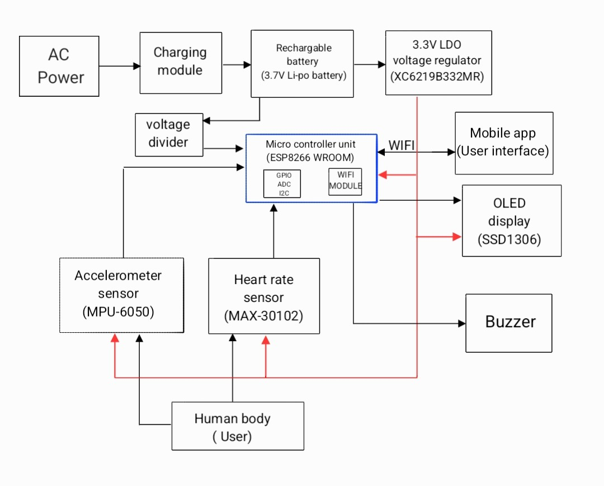
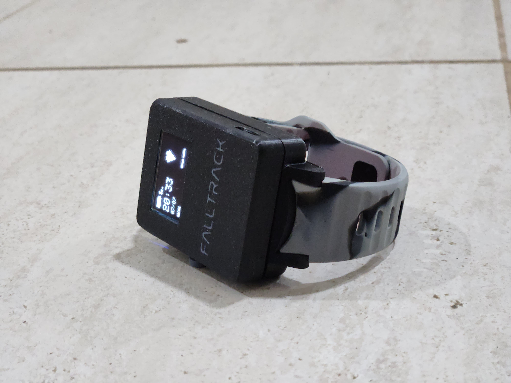
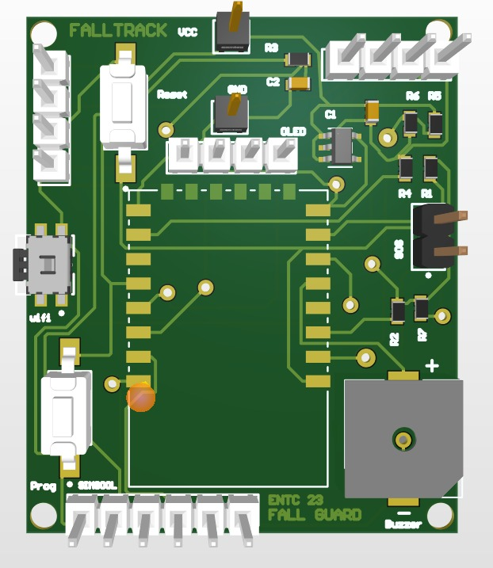
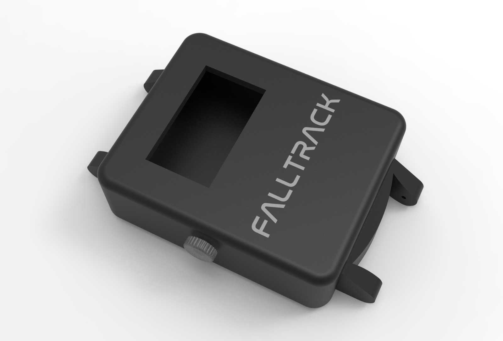

# FALL TRACK – Smart Fall Detection & Heart Rate Monitoring Watch

## Overview

**FALL TRACK** is a wearable safety device designed to detect falls and monitor heart rate in real time.
The device is intended for elderly individuals or people with medical conditions where falls or abnormal heart rate could be dangerous.

This project was developed as a personal hardware–software project during my **first year studying Electronic Engineering**.

The system combines **motion sensing, heart rate monitoring, wireless communication, and a mobile application** to create a complete fall detection and alert system.

---

# Key Features

• Fall detection using **MPU6050 accelerometer and gyroscope**
• Heart rate monitoring using **MAX3012 optical pulse sensor**
• **WiFi connectivity** for mobile app communication
• **OLED display interface** showing time, heart rate, and connection status
• **Flutter mobile application** for configuration and monitoring
• **Push-button controls** for device interaction
• **Portable LiPo battery powered wearable design**

---

# System Architecture

<p>
  
</p>

### Working Principle

1. MPU6050 continuously monitors motion and orientation.
2. A fall detection algorithm identifies sudden acceleration and orientation change.
3. If a fall is detected, the system checks the user's heart rate using MAX3012.
4. If an abnormal condition is detected, an alert is triggered.
5. The system sends an **SMS alert via SIM800L** and can notify through the **mobile app via WiFi**.

---

# Final Prototype



The final prototype integrates the sensors, microcontroller, communication modules, and display into a **compact wearable form factor**.

---

# PCB Design



Custom PCB design files are included in the repository.

Location:

```
hardware/pcb_design/
```

Included files:

* PCB layout
* Schematic
* Gerber files for manufacturing

---

# 3D Enclosure Design



The wearable enclosure was designed to house the electronics in a **compact smartwatch-style case**.

Location of CAD files:

```
hardware/3d_design/
```

Files included:

* `.STL` files for 3D printing
* `.STEP` files for CAD editing

---

# Hardware Components

| Component         | Description                       |
| ----------------- | --------------------------------- |
| ESP8266 (ESP-12F) | Main microcontroller              |
| MPU6050           | Motion sensing for fall detection |
| MAX3012           | Optical heart rate sensor         |
| SIM800L           | GSM module for SMS alerts         |
| OLED Display      | User interface                    |
| Push Button       | Device control                    |
| Buzzer            | Alert feedback                    |
| 3.7V LiPo Battery | Portable power source             |

---

# Firmware

The embedded firmware is located in:

```
firmware/esp8266_watch/
```

Main functions of the firmware:

* Sensor data acquisition
* Fall detection algorithm
* Heart rate measurement
* GSM communication
* WiFi communication
* OLED display interface
* User button interaction

---

# Mobile Application

A **Flutter-based mobile application** was developed to interact with the device.

Location:

```
mobile_app/falltrack_flutter_app/
```

App Features:

• Connects to the ESP8266 device
• Allows WiFi configuration
• Displays fall alerts
• Shows device status and heart rate data
• Stores alert history

Example UI:


---

# Repository Structure

```
falltrack-watch
│
├── firmware
│   └── esp8266_watch
│
├── mobile_app
│   └── falltrack_flutter_app
│
├── hardware
│   ├── pcb_design
│   ├── schematics
│   └── 3d_design
│
├── images
│
└── docs
```

---

# Future Improvements

• GPS location tracking
• Machine learning based fall detection
• Custom low-power PCB
• Improved battery management system
• Smaller wearable enclosure

---

# Author

**Abdul Hakam**
Electronic Engineering Student

---

# License

This project is released under the **MIT License**.
